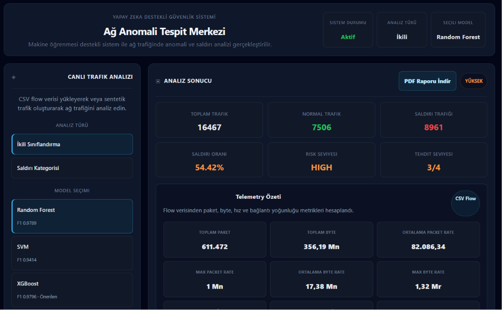
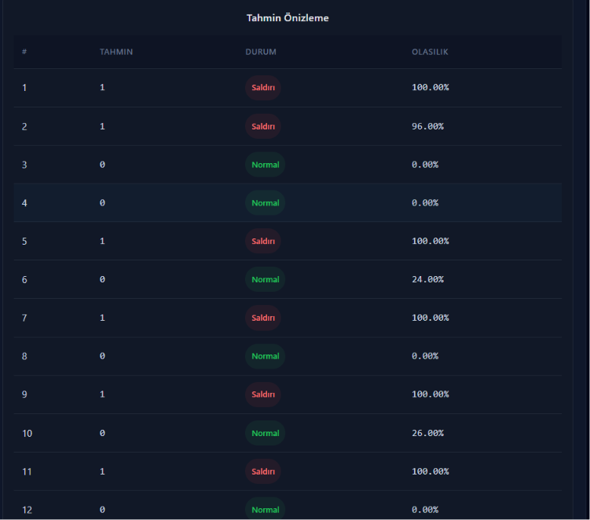
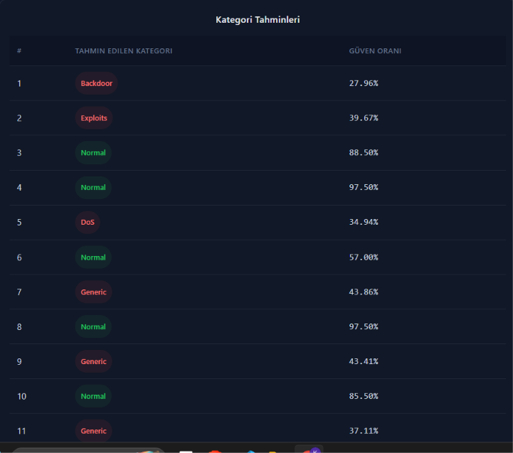
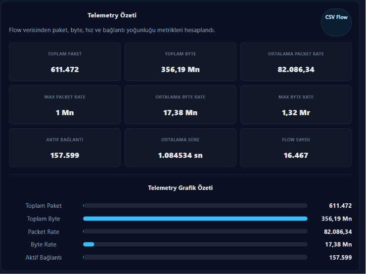
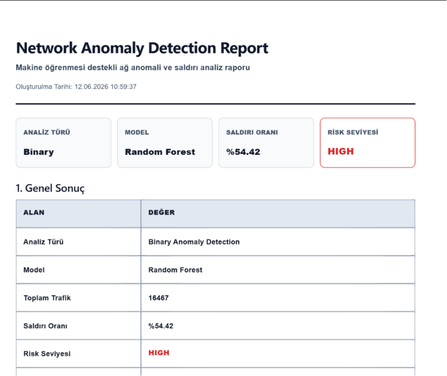

# 🛡️ Network Anomaly Detection System

Makine öğrenmesi tabanlı ağ anomali ve saldırı tespit sistemi.

Bu proje, ağ trafiğini analiz ederek normal ve saldırı davranışlarını tespit etmek amacıyla geliştirilmiştir. Sistem hem ikili sınıflandırma (Normal / Saldırı) hem de çoklu sınıf saldırı tespiti gerçekleştirebilmektedir.

---

# 🚀 Özellikler

* Binary Anomaly Detection (Normal / Attack)
* Multi-Class Attack Detection
* Random Forest, SVM ve XGBoost desteği
* Gerçek zamanlı trafik analizi
* Telemetry analizi
* Sentetik trafik simülasyonu
* Risk seviyesi hesaplama
* Saldırı kategori analizi
* Feature Importance analizi
* PDF rapor oluşturma
* Modern React Dashboard

---

# 📊 Desteklenen Saldırı Türleri

* Normal Traffic
* Generic
* Exploits
* DoS
* Fuzzers
* Reconnaissance
* Backdoor
* Shellcode
* Worms
* Analysis

---

# 🧠 Kullanılan Makine Öğrenmesi Modelleri

## Random Forest

Karar ağaçlarının topluluk yaklaşımı ile çalışır ve yüksek doğruluk sağlar.

## SVM (Support Vector Machine)

Verileri hiper düzlem yardımıyla ayıran güçlü bir sınıflandırma algoritmasıdır.

## XGBoost

Gradient Boosting yaklaşımına dayanan yüksek performanslı bir ensemble modelidir.

---

# 📈 Telemetry Analizi

Sistem ağ trafiğinden aşağıdaki telemetry metriklerini üretmektedir:

* Toplam Paket Sayısı
* Toplam Byte Miktarı
* Packet Rate
* Byte Rate
* Aktif Bağlantı Sayısı
* Flow Sayısı
* Ortalama Bağlantı Süresi

Bu metrikler ağ davranışının detaylı analiz edilmesini sağlar.

---

# 🔬 Sentetik Trafik Simülasyonu

Sistem CSV verisi olmadan test edilebilmesi için sentetik trafik üretmektedir.

Desteklenen trafik profilleri:

* Normal Traffic
* Mixed Traffic
* DDoS-like Traffic
* Port Scan-like Traffic

---

# 🏗️ Sistem Mimarisi

User
↓
React Dashboard
↓
FastAPI Backend
↓
Machine Learning Models
↓
Prediction Engine
↓
Risk Analysis Module
↓
PDF Reporting System

---

# 🗂️ Veri Seti

Bu projede UNSW-NB15 veri seti kullanılmıştır.

UNSW-NB15;

* Modern ağ saldırılarını içerir.
* Normal ve saldırı trafiğini birlikte barındırır.
* 49 adet ağ özelliğinden oluşur.
* Ağ güvenliği çalışmalarında yaygın olarak kullanılmaktadır.

---

# ⚙️ Kullanılan Teknolojiler

## Backend

* Python
* FastAPI
* Pandas
* NumPy
* Scikit-Learn
* XGBoost

## Frontend

* React
* TypeScript
* Vite
* CSS

---

# 📸 Ekran Görüntüleri

## Dashboard



## Binary Detection



## Multi-Class Detection



## Telemetry Analysis



## PDF Report



---

# 🛠️ Kurulum

## Backend

```bash
cd backend

pip install -r requirements.txt

uvicorn main:app --reload
```

## Frontend

```bash
cd frontend

npm install

npm run dev
```

---

# 🎯 Proje Çıktıları

* Ağ saldırılarının otomatik tespiti
* Saldırı kategorilerinin belirlenmesi
* Ağ telemetry verilerinin analizi
* Risk seviyesinin hesaplanması
* PDF rapor oluşturulması

---

# 🔮 Gelecek Çalışmalar

* SHAP Explainable AI entegrasyonu
* OpenTelemetry entegrasyonu
* Mininet tabanlı ağ simülasyonu
* Gerçek zamanlı paket yakalama
* Model optimizasyonları
* Docker ve Kubernetes desteği

---


##  👨‍💻 Geliştiriciler

- Abdulkadir Biner
- Melih Tülü
- Oktay Gün

---

## Akademik Amaç

Bu proje, Akıllı Ağlar - SDN, Network Programlama ve Yapay Zekâ Uygulamaları Dersi kapsamında  makine öğrenmesi tabanlı ağ güvenliği sistemlerinin geliştirilmesi, saldırı tespiti, veri analizi ve gerçek zamanlı güvenlik dashboard sistemlerinin tasarlanması amacıyla geliştirilmiştir.
